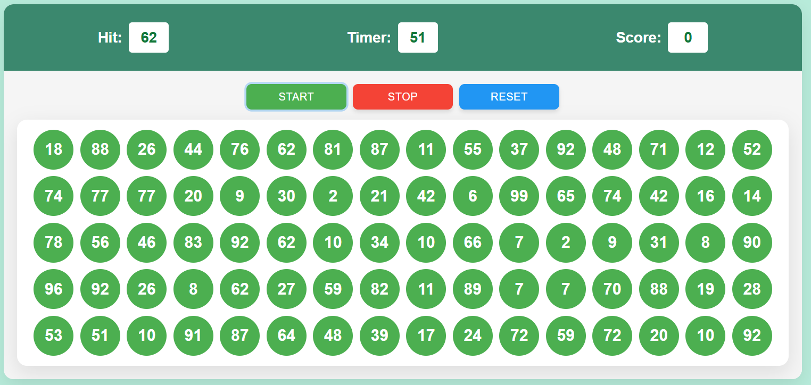
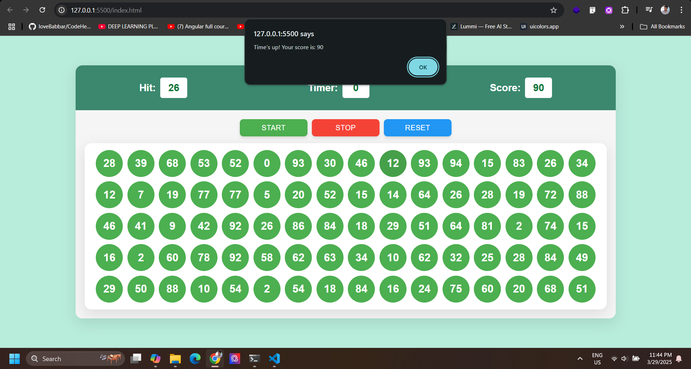

# Bubble Game

Bubble Game is a fun and interactive game where players click on bubbles containing a specific number to score points. The game is designed with a teal theme for a modern and visually appealing experience.

## How to Play
1. Click the "Start" button to begin the game.
2. A target number will appear in the "Hit" box.
3. Click on the bubble containing the target number to score points.
4. The game ends when the timer reaches zero or you stop the game manually.

## Features
- Responsive design with a teal-themed UI.
- Dynamic bubble generation with random numbers.
- Real-time score and timer updates.
- Start, Stop, and Reset controls.

## Screenshots

## Technologies Used
- HTML
- CSS
- JavaScript

## License
This project is licensed under the MIT License.

